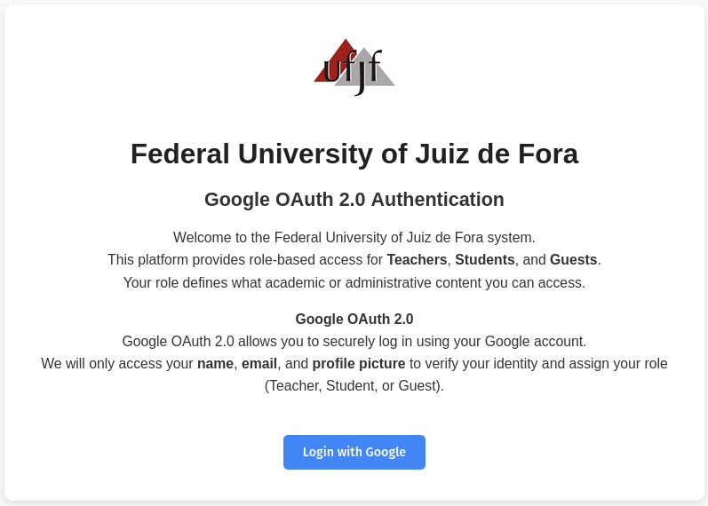
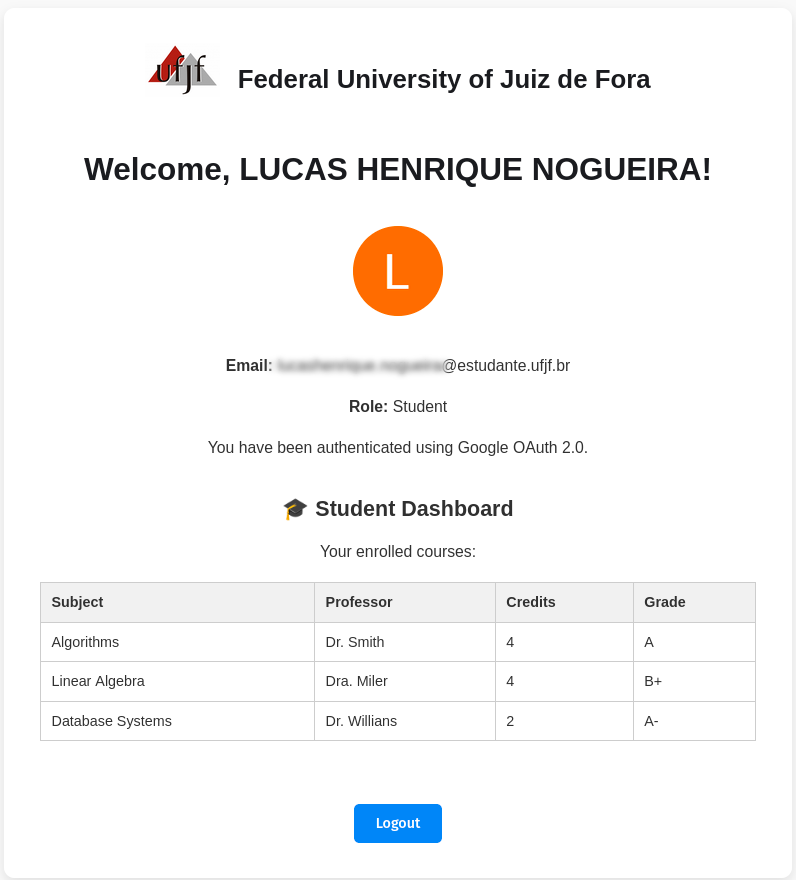

# 🔐 Google OAuth2 + RBAC (Controle de Acesso Baseado em Papéis)

Este projeto demonstra como implementar autenticação de usuários com Google OAuth 2.0 combinada com um sistema de Controle de Acesso Baseado em Papéis (RBAC), utilizando Node.js com o runtime Bun. Os usuários são identificados por e-mail institucional e recebem acessos personalizados conforme seu papel: Professor, Estudante ou Convidado.

---

## 🚀 Funcionalidades

- Autenticação com Google OAuth 2.0
- Controle de Acesso Baseado em Papéis (RBAC)
- Painéis diferentes para cada papel (professor, estudante, convidado)

---

## 🎓 Papéis e Regras

| Papel     | Domínio do e-mail            | Acesso                                                        |
|-----------|-------------------------------|----------------------------------------------------------------|
| Professor | @ufjf.br                      | Visualiza lista de alunos com faltas                          |
| Estudante | @estudante.ufjf.br            | Visualiza disciplinas, professores e notas                    |
| Convidado | qualquer outro domínio        | Visualiza links públicos da UFJF (site, SAC, cursos)          |

---

## 🔧 Etapa 1 – Criar projeto OAuth2 no Google Cloud

1. Acesse: https://console.cloud.google.com/
2. No topo, clique em “Selecionar projeto” → “Novo Projeto”
3. Dê um nome para o projeto, por exemplo: “UFJF OAuth App”
4. Clique em “APIs e Serviços” → “Credenciais”
5. Clique no botão “+ Criar credenciais” → “ID do Cliente OAuth”
6. Tipo de aplicativo: selecione “Aplicativo da Web”
7. Preencha as opções:
   - Nome: OAuth Web App
   - Origens JavaScript autorizadas:
     http://localhost:3000
   - URIs de redirecionamento autorizados:
     http://localhost:3000/callback
8. Clique em “Criar”

Você verá na tela:
- Seu Client ID (ID do cliente)
- Seu Client Secret (Chave secreta)

Copie esses dois valores, pois você usará no arquivo .env.

---

## 🧪 Etapa 2 – Criar o arquivo de ambiente

1. Renomeie o arquivo de exemplo de `.env.example` para `.env`:

```bash
mv .env.example .env
```

2. Preencha com os dados recebidos do Google:

```env
GOOGLE_CLIENT_ID=cole_aqui_o_client_id
GOOGLE_CLIENT_SECRET=cole_aqui_o_client_secret
GOOGLE_REDIRECT_URI=http://localhost:3000/callback
```

---

## ⚙️ Etapa 3 – Instalar o Bun

O Bun é um runtime JavaScript moderno que substitui o Node.js com mais performance.

Site oficial: https://bun.sh

### Para Linux:

```bash
curl -fsSL https://bun.sh/install | bash
```

### Para Windows (pelo PowerShell):

```powershell
irm https://bun.sh/install.ps1 | iex
```

Após a instalação, reinicie o terminal e verifique:

```bash
bun --version
```

---

## ▶️ Etapa 4 – Executar o Projeto

Com tudo configurado, execute o seguinte comando:

```bash
bun run oauth
```

Em seguida, acesse no navegador:

```
http://localhost:3000
```

Clique no botão “Login with Google”.

---

## 🗂️ Estrutura do Projeto

O sistema está organizado da seguinte forma:

- public/index.html → Página inicial e informações do projeto
- public/style.css → Estilização da aplicação
- src/index.js → Código principal da aplicação com Express e OAuth
- src/rbac.js → Função para identificar o papel do usuário
- src/role_view.html → Blocos HTML com conteúdo específico para cada papel
- .env.example → Exemplo de como deve ser o .env

---

## 👨‍💻 Visualizações por Papel

- 👨‍🏫 Professor:
  - Tabela de alunos, matrícula e número de faltas

- 🎓 Estudante:
  - Lista de disciplinas, professores, créditos e notas

- 🌐 Convidado:
  - Links úteis: site da UFJF, central de atendimento, graduação


🖼️ Tela de Login Inicial:

<p align="center">
  
</p>

🖼️ Dashboard do Estudante (após login):

<p align="center">
  
</p>

---

## 📚 Conceitos Relacionados

Este projeto é uma aplicação prática dos seguintes conceitos da disciplina de Gestão de Identidade e Acesso:

- Autenticação federada com Google OAuth2
- Autorização baseada em papéis (RBAC)
- Redirecionamento seguro com tokens de ID (JWT)
- Servidor Express com integração de frontend estático
---
